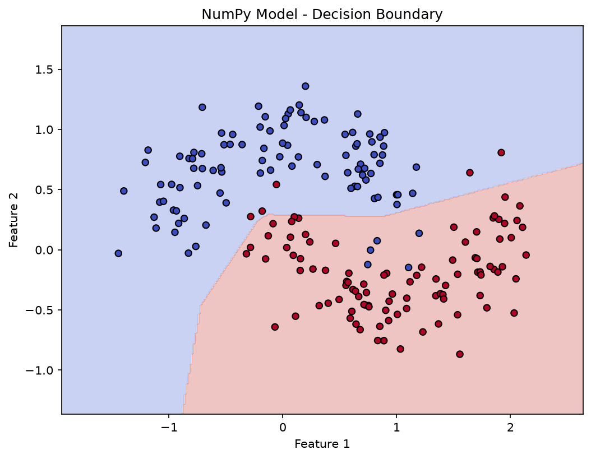
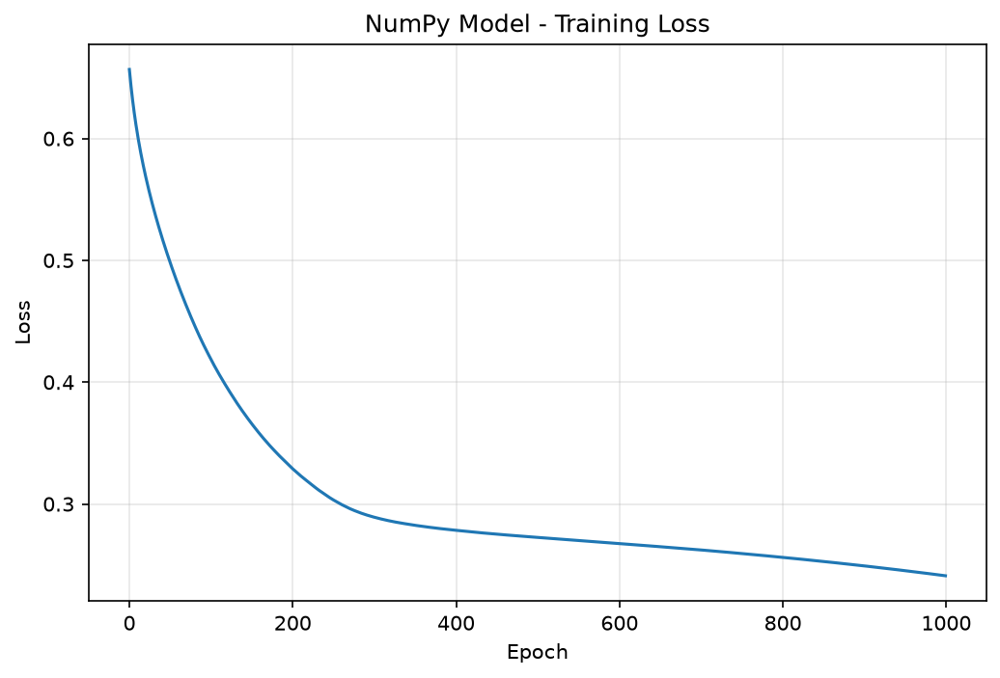
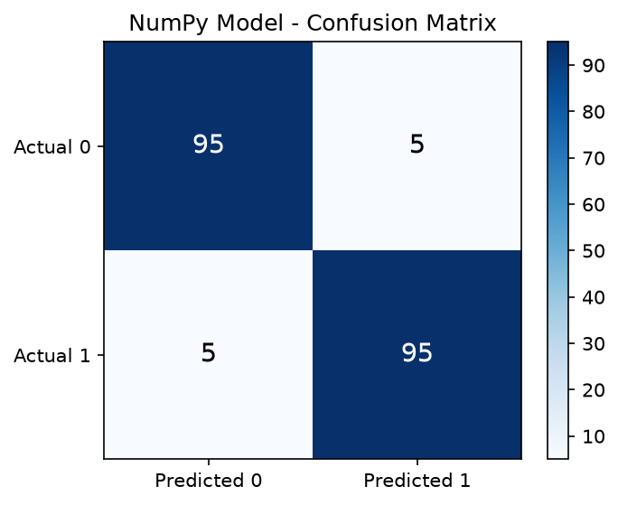
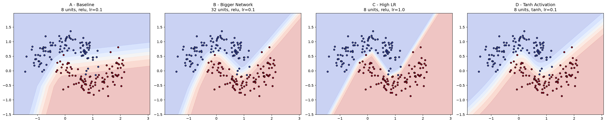

# Neural Net

A from-first-principles study of how neural networks learn — implemented twice: once by hand in NumPy to understand every gradient calculation, and once in PyTorch to apply the same ideas with production-grade tooling. Includes a controlled experiment isolating the effect of network capacity and learning rate on convergence.

## Results at a glance

| Implementation | Test Accuracy | F1 Score |
|---|---|---|
| NumPy (from first principles) | 95.0% | — |
| PyTorch | 94.5% | 0.945 |
| PyTorch, best config (High LR) | 99.5% | 0.995 |

Both implementations were trained and evaluated on the same dataset and produced consistent results — the strongest signal that the manually derived backpropagation math is correct.

## Why this project exists

Frameworks like PyTorch compute gradients automatically. That's powerful, but it's easy to use `loss.backward()` without understanding what it's actually doing. This project builds the same network twice: once with every gradient written out by hand, once with PyTorch's autograd — so the automation could be checked against math that was already understood and verified independently.

## Dataset

scikit-learn's `make_moons`: two interleaving crescent-shaped classes, 1000 samples, 20% noise, 80/20 train/test split. Chosen specifically because no straight line can separate the two classes well — a network has to learn an actual curve, which is a meaningful test of whether non-linear learning is happening at all.

## Project structure

```
neural-net/
├── numpy_nn/
│   ├── activations.py      # ReLU, sigmoid, and their derivatives
│   ├── losses.py            # Binary cross-entropy and its derivative
│   ├── network.py           # Forward pass, backpropagation, training loop
│   ├── metrics.py           # Accuracy, precision, recall, F1
│   └── visualize.py         # Decision boundary, loss curve, confusion matrix plots
├── pytorch_nn/
│   ├── model.py              # nn.Module network definition
│   ├── train.py               # DataLoader-based training loop
│   └── evaluate.py
├── data/
│   └── dataset.py             # Dataset generation and splitting
├── tests/                      # 31 unit tests
├── reports/
│   ├── decision_boundary.png
│   ├── loss_curve.png
│   ├── confusion_matrix.png
│   ├── experiment_comparison.png
│   └── experiment_report.md
├── run_experiments.py
└── requirements.txt
```

## Implementation 1: NumPy from first principles

Architecture: 2 inputs → hidden layer (ReLU, 8 units) → 1 output (sigmoid). Trained with manually derived backpropagation and full-batch gradient descent for 1000 epochs.

Every gradient in this implementation — including the neat simplification `dZ2 = A2 - y` that comes from combining the sigmoid and binary cross-entropy derivatives — was derived and verified before being written into code.

**Results on held-out test data:**
- Accuracy: 95.0%
- Loss decreased steadily from 0.657 to 0.249 over training

<p align="center">
  
  
</p>

## Implementation 2: PyTorch

The same architecture, rebuilt with `nn.Module`, `DataLoader` for mini-batch training, `BCELoss`, and SGD.

**Results on held-out test data:**
- Accuracy: 94.5% | Precision: 94.1% | Recall: 95.0% | F1: 94.5%

Training and validation loss remained closely aligned throughout training, indicating the model generalized rather than memorized.

<p align="center">
  
</p>

## Experiment: what actually improves performance

Four configurations were trained under identical conditions to isolate the effect of hyperparameters:

| Configuration | Hidden Units | Activation | Learning Rate | Accuracy | F1 |
|---|---|---|---|---|---|
| A — Baseline | 8 | ReLU | 0.1 | 97.5% | 0.975 |
| B — Larger network | 32 | ReLU | 0.1 | 98.0% | 0.980 |
| C — High learning rate | 8 | ReLU | 1.0 | **99.5%** | **0.995** |
| D — Tanh Activation | 8 | Tanh | 0.1 | 96.0% | 0.960 |

<p align="center">
  
</p>

**Finding 1 — Capacity helps, with limits.** Quadrupling the hidden layer (Config B) gave a small but real accuracy gain. On a dataset this simple, the improvement is modest — the extra capacity would likely matter more on a harder problem.

**Finding 2 — A high learning rate can be unstable.** Config C achieved 99.5% accuracy in this run, but earlier experiments showed it oscillating and producing lower accuracy (96.5%). High learning rates can be highly sensitive and less reproducible due to optimizer overshooting.

**Finding 3 — Activation function choice matters.** Config D (Tanh) achieved only 96.0% accuracy. Tanh's saturating gradients at both extremes slow down learning compared to ReLU's constant gradient of 1 for positive inputs.

Full write-up: [reports/experiment_report.md](reports/experiment_report.md)

## Testing

```bash
pytest tests/ -v
```

31 tests across activation functions, loss computation, the forward/backward pass, and evaluation metrics. All passing.

## Setup and usage

```bash
git clone https://github.com/abdulrehman10raja/neural-net.git
cd neural-net
pip install -r requirements.txt
```

Train the NumPy model:
```python
from numpy_nn.network import NeuralNetwork
from data.dataset import generate_dataset

X_train, X_test, y_train, y_test = generate_dataset()
model = NeuralNetwork(input_size=2, hidden_size=8)
model.train(X_train, y_train, epochs=1000, learning_rate=0.1)
```

Train the PyTorch model:
```bash
python -m pytorch_nn.train
```

Run the full experiment suite:
```bash
python run_experiments.py
```
